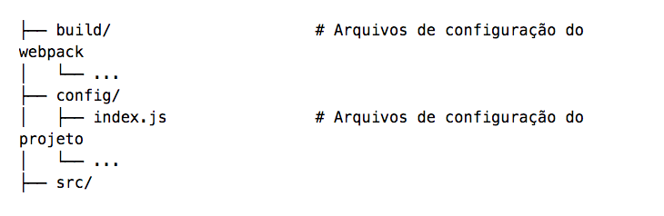
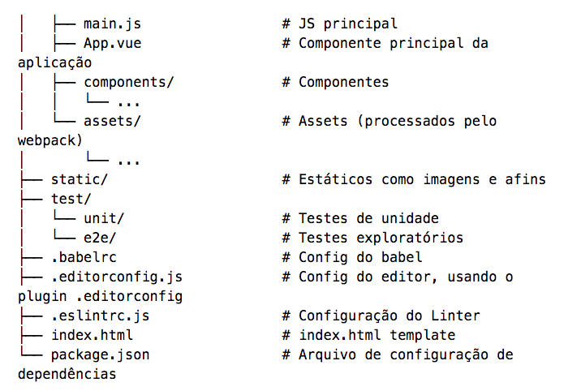

# Vue.js

# Opções de templates:

## Para listar todos os templates utilize o comando: 

```
vue list
```

1. browserify - A full-featured Browserify + vueify setup with hot-reload, linting & unit testing.
2. browserify-simple - A simple Browserify + vueify setup for quick prototyping.
3. pwa - PWA template for vue-cli based on the webpack template
4. simple - The simplest possible Vue setup in a single HTML file
5. webpack - A full-featured Webpack + vue-loader setup with hot reload, linting, testing & css extraction.
6. webpack-simple - A simple Webpack + vue-loader setup for quick prototyping.


## Como funciona a lista de pastas do vue: 




# todo-list

> Lista de tarefas com Vue

## Build Setup

``` bash
# install dependencies
npm install

# serve with hot reload at localhost:8080
npm run dev

# build for production with minification
npm run build

# build for production and view the bundle analyzer report
npm run build --report
```

# Adicionando funcao a diretiva #

Exemplo:

v-on:keyup ***.enter***=""

Isso irá dizer ao Vue que deve acionar a função somente quando o enter for clicado 
o Vue JS cria alguns atalhos para o keycode mais utilizado.

Para ver o keycode correto entre no site http://keycode.info/

```
<input class="new-todo"
           v-on:keyup="addTask"
           placeholder="O que precisa ser feito?">
```

##### Usando açúcar sintático #####

O vue.js nos da alguns atalhos interessantes para nao precisar ficar digitando muito código 

Para diretiva:

Inves de usar o ***v-on:*** utilize ***@***

Ex:

```
// De:
<input class="new-todo"
           v-on:keyup="addTask"
           placeholder="O que precisa ser feito?">

Para:
<input class="new-todo"
          @keyup="addTask"
          placeholder="O que precisa ser feito?">
```

### Alguns eventos ###

O .stop que evita que o evento seja propagado:

```
<a v-on:click.stop="doThis"></a>”
```

O modificador .prevent evita que a ação padrão do navegador aconteça, como em um envio de formulário que recarregaria a página.

``` 
<form v-on:submit.prevent="onSubmit"></form>
```

Temos também o .self que faz com que o evento seja disparado somente ao clicar no elemento, e não em seus filhos, como ocorre por padrão na maioria dos navegadores atuais.

```
<div v-on:click.self="doThat">...</div>
```
For detailed explanation on how things work, checkout the [guide](http://vuejs-templates.github.io/webpack/) and [docs for vue-loader](http://vuejs.github.io/vue-loader).

# Diferença de v-if e v-show #

Ambas tem a mesma função mostrar ou não um elemento, porem o v-if não mostra o elemento no html já o v-show o elemento irá aparecer no html porem com o style: display:none.


***O v-if não vai renderizar o elemento, reduzindo assim o custo computacional, ou seja, terá uma melhor performance na primeira renderização. Porém, se essa condição mudar muitas vezes com o tempo, então o custo será maior, pois ele precisará inserir e remover o elemento no DOM.***

###Sendo assim:###

Caso sua necessidade seja não mostrar o elemento e em alguma situação na tela você mostrar o elemento então é menos custoso utilizar o v-show. 

Caso você queira mostrar um elemento ou não e esse elemento não mudará de status então é melhor utilizar o v-if pois computacionalmente falando terá menos custo.

***Via de regra, se a condição mudar muito, use v-show . Caso contrário, use o v-if***


#Quando queremos que uma classe seja mostrada quando um condição for verdadeira#


###Exemplo###

```javascript
// <label :class="{ 'Classe-A-Ser-Adicionada': CONDIÇÃO }" >{{ todo.title }}</label>
 <label :class="{'todo-completed': todo.completed}">{{ todo.title }}</label>
```


